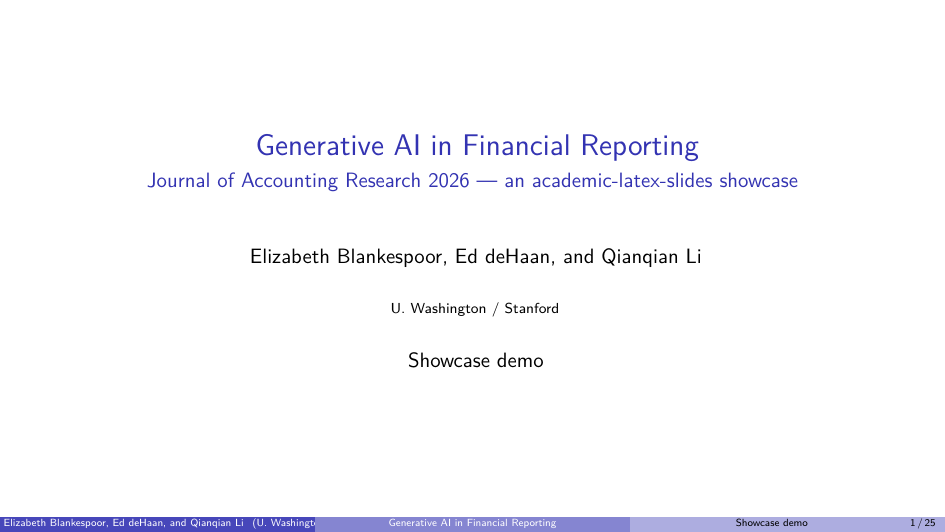
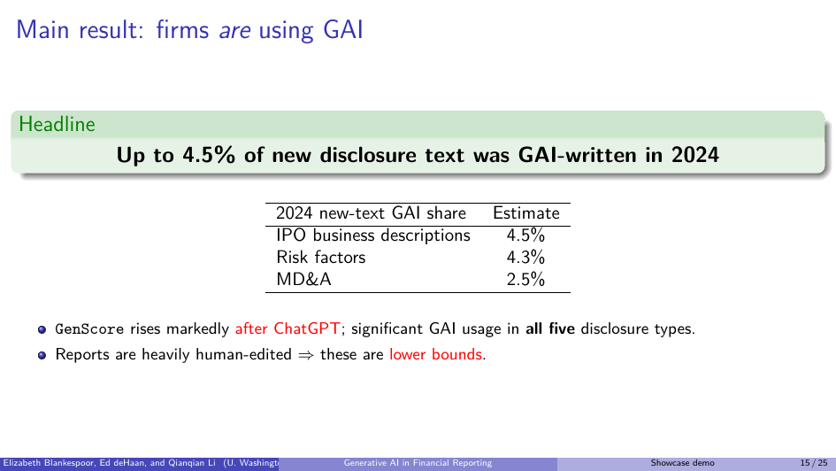
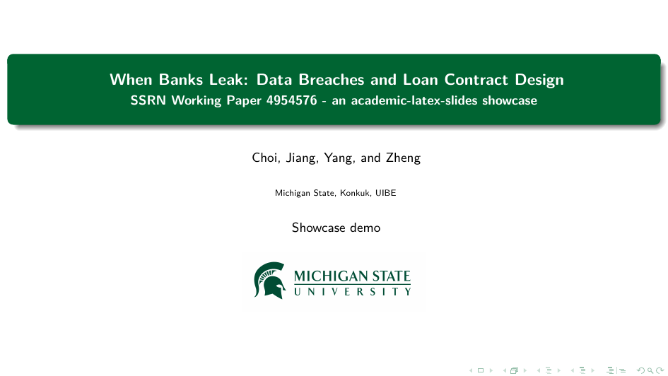
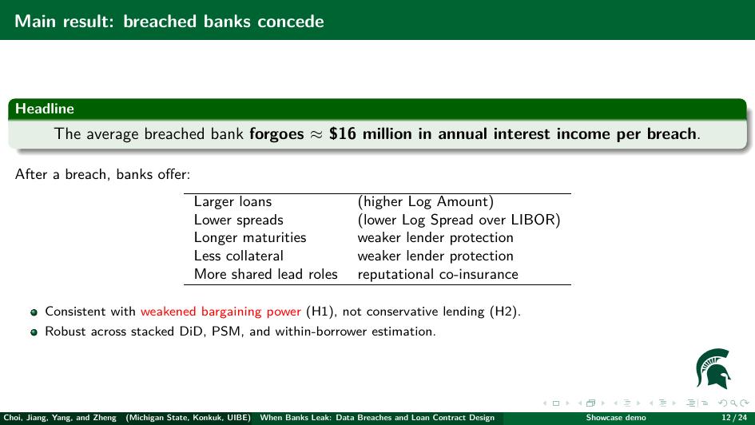

# Academic LaTeX Slides

> An interview-first agent skill that turns a talk into a compile-ready,
> modular LaTeX Beamer project — without fabricating academic content.

[](LICENSE)
[](#requirements)
[](#scaffold-helper-standalone)
[](#installation)

**English** · [简体中文](README.zh-CN.md)

`academic-latex-slides` is a portable skill that can be installed in **Codex**
as a standalone skill or distributed to **Claude Code** as a plugin. It does one
thing well: it **interviews you before it writes anything**, then generates a
modular Beamer deck you can compile immediately.

Its defining rule: **it never invents results, citations, data, or claims to
fill space.** If you only have a topic, it produces a structure, placeholders,
and an explicit missing-materials list — not a confident, wrong deck.

---

## Table of Contents

- [Academic LaTeX Slides](#academic-latex-slides)
  - [Table of Contents](#table-of-contents)
  - [Features](#features)
  - [Why interview-first](#why-interview-first)
  - [Examples](#examples)
  - [Requirements](#requirements)
  - [Repository layout](#repository-layout)
  - [Installation](#installation)
    - [Claude Code](#claude-code)
    - [Codex](#codex)
    - [Building portable ZIPs](#building-portable-zips)
  - [Usage](#usage)
    - [The workflow](#the-workflow)
    - [Inside the interview](#inside-the-interview)
    - [Deck blueprints](#deck-blueprints)
    - [End-to-end walkthrough](#end-to-end-walkthrough)
    - [Generated project structure](#generated-project-structure)
    - [Compiling the deck](#compiling-the-deck)
  - [Scaffold helper (standalone)](#scaffold-helper-standalone)
  - [Template variants](#template-variants)
  - [Troubleshooting](#troubleshooting)
  - [Development \& maintenance](#development--maintenance)
  - [Scope](#scope)
  - [Acknowledgements](#acknowledgements)
  - [License](#license)

---

## Features

- **Two deck archetypes** — `lecture` and `research talk`, each with its own
  narrative spine.
- **Four visual variants** — `MSU`, `SJTU`, `CityU`, and `Generic`
  (institution-neutral, no branding). Same content logic; choose by visual
  identity only.
- **Bilingual interview** — the agent interviews you in your language
  (Chinese in → Chinese out) using tiered, scripted questions.
- **Inference-first** — it reads your attached materials and existing notes,
  echoes back what it extracted, and asks only the gaps.
- **Low-friction** — blocking questions vs. defaulted shaping questions, plus a
  "use defaults" escape hatch (the outline approval gate always still applies).
- **Two-round confirmation** — after the outline, the agent runs a
  content-gated **Round A** (outline-driven, per-slide decisions the outline
  alone cannot settle) and **Round B** (missing-materials-driven, the fate of
  each gap item by item), then waits for explicit approval. Either round is
  skipped in one line when it has nothing real to decide.
- **No fabrication** — missing evidence becomes a `TODO` placeholder and a
  missing-materials line, never an invented number or citation.
- **Modular output** — `main.tex` + `sections/` + `figures/` + `references.bib`.
- **One build path** — every variant targets `latexmk -xelatex`, so Chinese and
  English decks compile the same way.
- **Deterministic scaffold** — a dependency-free Python script generates the
  starter project; the agent then fills in approved content.

## Why interview-first

Academic decks get better when the agent spends its effort understanding the
talk before it writes LaTeX. The skill therefore enforces three gates:

1. **Interview** before generating — never jump from a vague request to `.tex`.
   An inference pass reads your materials first; tiered questions ask only the
   genuine gaps.
2. **Outline approval** — a requirements summary, slide-by-slide outline, and
   missing-materials list are produced, then refined through two content-gated
   confirmation rounds (outline-driven, then missing-materials-driven).
   Generation waits for your explicit approval of the post-confirmation plan.
3. **Academic integrity** — empirical findings, citations, data descriptions,
   theorem statements, and numerical magnitudes are never invented.

These gates exist because an interview built on a misread source produces a
confident, wrong deck. The skill spends its effort understanding the talk so the
LaTeX it writes is the easy part.

## Examples

**Featured — slides from real research papers.** Each deck was generated by
the full interview → outline-approval → generate workflow, faithful to the
paper's own numbers (figures described, never fabricated).

*Blankespoor, deHaan & Li — Generative AI in Financial Reporting* (JAR 2026),
`Generic` variant:

| Title slide | Main-result slide |
| --- | --- |
|  |  |

*Choi, Jiang, Yang & Zheng — When Banks Leak* (SSRN 2025), `MSU` variant:

| Title slide | Main-result slide |
| --- | --- |
|  |  |

Full decks: [Blankespoor](examples/blankespoor2026-generative-ai-in-financial-reporting.pdf)
· [Jiang](examples/jiang2025-when-banks-leak.pdf) · more in [`examples/`](examples/).

**Template demo — one deck, four skins.** The **same** research-talk content
rendered in all four variants so you can compare styles directly:
[MSU](examples/msu-research-talk.pdf) ·
[SJTU](examples/sjtu-research-talk.pdf) ·
[CityU](examples/cityu-research-talk.pdf) ·
[Generic](examples/generic-research-talk.pdf) *(illustrative placeholder
numbers, not real data)*.

## Requirements

| Purpose | Requirement |
| --- | --- |
| Run the skill | An agent host: **Claude Code** (plugin) or **Codex** (skill) |
| Compile decks | A LaTeX distribution with **XeLaTeX** — TeX Live (full scheme recommended) or MiKTeX |
| Bibliography | **`biber`** (ships with TeX Live; latexmk invokes it automatically) |
| Build automation | **`latexmk`** (recommended) |
| Scaffold script | **Python 3.8+** (standard library only — no `pip install`) |

> **Note on fonts.** All four templates use the `ctexbeamer` document class, so
> *even English-only decks* compile through XeLaTeX with Chinese font support
> loaded. A full TeX Live install (which bundles the Fandol CJK fonts and the
> `ctex`/`biblatex` packages) is the friction-free choice. On MiKTeX, allow
> on-the-fly package installation on first compile.

## Repository layout

```text
academic-latex-slides/
├── skills/academic-latex-slides/        # canonical skill source — EDIT HERE
│   ├── SKILL.md
│   ├── references/                      # interview protocol, blueprints, rules
│   ├── assets/templates/                # MSU / SJTU / CityU / Generic template assets
│   ├── scripts/scaffold.py              # deterministic starter generator
│   └── agents/openai.yaml               # Codex interface metadata
├── plugins/academic-latex-slides/       # synced mirror for the Claude Code plugin
│   ├── .claude-plugin/plugin.json
│   └── skills/academic-latex-slides/    # generated copy — DO NOT edit by hand
├── .claude-plugin/marketplace.json      # Claude Code marketplace metadata
├── scripts/
│   ├── sync_distributions.py            # copy canonical → plugin mirror
│   └── build_portable_packages.py       # build transfer ZIPs
├── README.md
└── LICENSE
```

The canonical source lives under `skills/academic-latex-slides/`. The
`plugins/` tree is a **generated mirror** — always edit the canonical source and
run the sync script (see [Development & maintenance](#development--maintenance)).

## Installation

### Claude Code

The plugin is distributed through a Claude Code marketplace
(`.claude-plugin/marketplace.json`). Install it from a **GitHub repository** or
from a **local path**.

**From GitHub** (replace `<owner>/<repo>` with the host repository):

```text
/plugin marketplace add <owner>/<repo>
/plugin install academic-latex-slides@academic-latex-slides
```

**From a local clone or extracted ZIP:**

```text
/plugin marketplace add /absolute/path/to/academic-latex-slides
/plugin install academic-latex-slides@academic-latex-slides
```

The marketplace name and the plugin name are both `academic-latex-slides`
(hence `academic-latex-slides@academic-latex-slides`). For a **private** GitHub
repo, the host authenticates with your existing git credentials. To pick up a
new version later:

```text
/plugin marketplace update academic-latex-slides
```

then restart Claude Code (or reload plugins) so the refreshed skill is active.
If you previously added it from a local path, remove that entry first
(`/plugin marketplace remove <old-name>`) to avoid a name clash.

### Codex

**Manual copy** — copy the canonical skill folder into Codex's skill directory:

```bash
# macOS / Linux
cp -R skills/academic-latex-slides ~/.codex/skills/
```

```powershell
# Windows PowerShell
Copy-Item -Recurse skills\academic-latex-slides $HOME\.codex\skills\
```

Then start a new Codex session and invoke it:

```text
Use $academic-latex-slides to create a research-talk deck.
```

### Building portable ZIPs

To transfer the skill to another machine without git:

```bash
python scripts/build_portable_packages.py
```

This writes:

- `dist/academic-latex-slides-codex-skill.zip`
- `dist/academic-latex-slides-claude-plugin.zip`

Extract the Codex ZIP so the final folder on the target machine is
`~/.codex/skills/academic-latex-slides/`. Extract the Claude ZIP and point
`/plugin marketplace add` at the extracted folder.

## Usage

### The workflow

The agent always runs three phases:

| Phase | What happens |
| --- | --- |
| **1. Interview** | Inference pass on your materials, then tiered bilingual questions (Tier 1 blocking → Tier 2 shaping → gated Tier 3 deep-dive). |
| **2. Outline gate** | Builds the requirements summary + slide-by-slide outline + missing-materials list, refines them through **Round A** (outline-driven) and **Round B** (missing-materials-driven), then **stops and waits for your approval**. |
| **3. Generate** | Runs the scaffold, replaces starter sections with approved content, reserves slots for formulas/figures/appendix when called for, returns the project path and compile command. |

### Inside the interview

The interview is the part that decides deck quality, so it is structured rather
than ad hoc.

**Inference pass (always first).** The agent re-reads your request and every
attached file, fills in any field it can safely infer, and echoes back what it
extracted (structure, core results, data, citations) for you to confirm or
correct. It asks only the genuine gaps. The visual template is the one field it
**never** infers — it is always asked explicitly.

**Nine core fields** are resolved (asked, inferred, or defaulted) before any
outline:

| Field | Default if you defer |
| --- | --- |
| Template (`MSU` / `SJTU` / `CityU` / `Generic`) | none — always asked |
| Archetype (`lecture` / `research talk`) | inferred from context, else asked |
| Language | matches your language |
| Core message (the one thing to remember) | none — always asked |
| Metadata (title, author, institute, date) | flagged `TODO` placeholders |
| Audience | graduate peers in the field |
| Timing + slide target | ≈ 1 content slide per 1.5 min |
| Material readiness (full / outline / topic) | inferred from what you gave |
| Academic components (formulas / figures / citations / appendix) | inferred from archetype; inline author-year citations, no bibliography slide |

**Tiered questions, batched as one colleague-style message:**

- **Tier 1 — blocking:** template, archetype, language, core message. Cannot be
  safely defaulted.
- **Tier 2 — shaping:** metadata, audience, timing, material readiness,
  academic components. Each carries a stated default you can accept in one word.
- **Tier 3 — gated deep-dive:** sharp archetype-specific questions, asked
  **only** when you supplied an outline or full content. If you have only a
  topic, this is skipped — deep questions about absent content only create
  fabrication pressure.

**Escape hatch.** Say *"use defaults"* (or *“用默认”*) and every Tier 2/3 item
is filled with its default, stated explicitly. The outline approval gate still
applies — defaults speed the interview, they never skip the gate.

**Two-round post-outline confirmation.** Once the three artifacts exist, the
agent confirms them twice more before the approval gate:

- **Round A — outline-driven:** per-slide decisions the outline alone cannot
  settle (depth/level, which result leads, split vs. merge, what gets cut if the
  deck runs long, notation or worked-example choice, section order).
- **Round B — missing-materials-driven:** each gap, item by item — supply it
  now, supply later (dated `TODO`), drop the slide/claim, or keep a clearly
  marked placeholder.

Both rounds are **content-gated**: a round with nothing real to decide is
skipped in a single line, never padded with manufactured questions. The three
artifacts are updated after each round, so you approve an accurate plan rather
than a first guess.

### Deck blueprints

Each archetype has a default narrative spine the agent adapts (never a rigid
template) once the interview clarifies the talk.

**Lecture** — teaching, scaffolding, examples and recap over novelty:

> Title → Learning objectives → Course roadmap / where this lecture fits →
> Core concept(s) → Derivation or worked example → Exercise / application →
> Summary & takeaways

**Research talk** — persuading around a contribution; question → design →
result chain delivered fast:

> Title → Motivation → Research question / gap → Contribution →
> Data & design → Main results → Supplementary analysis → Conclusion

**Pacing.** The default is ≈ 1 content slide per 1.5 minutes. A `lecture`
weights explanation, worked examples, and recap; a `research talk` weights
motivation, identification, results, and interpretation. When timing is short,
breadth is cut before the narrative spine. The blueprint adapts across domains —
a panel-data econometrics talk, a lab-protocol lecture, and a numerical-methods
seminar all use the same spine with different slide roles.

### End-to-end walkthrough

A realistic session, from request to compiled PDF.

**1 — You ask.** Give the agent your topic and any materials up front:

```text
Use $academic-latex-slides. I'm giving a 20-minute research talk on
"Audit partner rotation and earnings quality". CityU style, slides in English.
Here are my notes and the regression table. (attaches notes.md, table1.tex)
```

**2 — The agent interviews you** (inference pass first, then only the gaps):

```text
I read your notes and Table 1. Here's what I extracted:
  • RQ: does mandatory partner rotation change discretionary accruals?
  • Sample: 2008–2020 Chinese listed firms; main coeff ≈ -0.013 (p<0.05)
  • Identification: staggered rotation, firm + year FE

A few things so I build the right deck —
  • If the audience remembers one number, is it the -0.013, or an economic-
    magnitude restatement?
  • What does a skeptical referee attack first — selection, or the FE design?
  • Title / author / institute / date? (placeholders are fine — I'll flag them)
  • I'll assume figures + inline author-year citations (e.g., “Gul, Wu, and
    Yang 2013”) — no separate references slide, no appendix. Right?
```

**3 — The agent presents the outline and waits** (the approval gate):

```text
REQUIREMENTS SUMMARY
  Template: CityU · Archetype: research talk · Language: EN
  Timing: ~20 min → ~13 content slides · Audience: accounting peers (default)

SLIDE-BY-SLIDE OUTLINE
  1 Title   2 Motivation   3 Research question / gap   4 Contribution
  5 Data & sample   6 Identification   7 Main result (Table 1)
  8 Economic magnitude   9 Robustness   10 Heterogeneity   11 Conclusion

MISSING MATERIALS
  • TODO: economic-magnitude restatement of -0.013
  • TODO: robustness table not yet supplied

Here's what I'll build, and what I can't fill without your input.
Reply 'approved' to generate, or correct the scope and I'll revise.
```

**4 — You approve.** The agent runs the scaffold and writes the sections:

```text
approved
```

**5 — The agent generates and hands back:**

```text
Created research-talk project with the cityu template at output/audit-talk
Compile:  cd output/audit-talk && latexmk -xelatex main.tex
```

**6 — You compile:**

```bash
cd output/audit-talk
latexmk -xelatex main.tex
```

Sections backed by your materials are filled; unsupported claims remain as
clearly marked `TODO:` placeholders for you to complete.

### Generated project structure

```text
output/audit-talk/
├── main.tex                 # template-rendered preamble + \input wiring
├── sections/
│   ├── 01_*.tex             # archetype-specific starter sections
│   ├── 02_*.tex
│   ├── 03_*.tex
│   ├── 04_*.tex
│   └── 90_appendix.tex      # \appendix stub, used only when requested
├── figures/                 # your figures (empty by default)
├── references.bib           # your bibliography (empty by default)
└── <template assets>        # logos / theme .sty files for the chosen variant
```

The starter section filenames depend on the archetype:

| Archetype | Starter sections |
| --- | --- |
| `research-talk` | `01_motivation` · `02_design` · `03_results` · `04_conclusion` |
| `lecture` | `01_learning_goals` · `02_core_content` · `03_examples` · `04_summary` |

Section *headings* follow `--language` (English or Chinese); the filenames stay
the same. The agent replaces these starters with your approved content and may
add, split, or rename sections to match the approved outline.

### Compiling the deck

```bash
latexmk -xelatex main.tex
```

`latexmk` runs the XeLaTeX passes and invokes `biber` automatically. Without
`latexmk`, compile manually:

```bash
xelatex main.tex
biber main
xelatex main.tex
xelatex main.tex
```

## Scaffold helper (standalone)

The agent runs this for you, but you can also generate a starter project
directly. It is deterministic and has **no third-party dependencies**.

```bash
python skills/academic-latex-slides/scripts/scaffold.py \
  --template sjtu \
  --deck-type lecture \
  --language zh \
  --title "Introduction to Asset Pricing" \
  --subtitle "Lecture 1" \
  --author "Your Name" \
  --institute "Your Institute" \
  --date "2026-05-17" \
  output/slides
```

```powershell
# Windows PowerShell (use backtick for line continuation)
python skills\academic-latex-slides\scripts\scaffold.py `
  --template sjtu --deck-type lecture --language zh `
  --title "Introduction to Asset Pricing" --subtitle "Lecture 1" `
  --author "Your Name" --institute "Your Institute" `
  --date "2026-05-17" output\slides
```

| Argument | Required | Values / notes |
| --- | --- | --- |
| `output_dir` (positional) | yes | target directory |
| `--template` | yes | `msu` · `sjtu` · `cityu` · `generic` |
| `--deck-type` | yes | `lecture` · `research-talk` |
| `--language` | yes | `en` · `zh` (selects starter section language) |
| `--title` | yes | LaTeX-escaped automatically |
| `--subtitle` | no | defaults to empty |
| `--author` | yes | LaTeX-escaped automatically |
| `--institute` | yes | LaTeX-escaped automatically |
| `--date` | yes | free text, e.g. `2026-05-17` |
| `--force` | no | allow writing into a non-empty directory |

Then compile with `latexmk -xelatex main.tex`.

## Template variants

All variants share the same content logic, interview flow, and modular output.
Choose by visual identity only — the agent will not infer the template from
your language, institution, or talk type.

| Variant | Visual character | Good fit | Bundled assets |
| --- | --- | --- | --- |
| **MSU** | Green academic palette, classic Beamer feel | General talks, seminars, internal presentations | `msu.png`, `Logo.png` |
| **SJTU** | Formal institutional theme with a strong cover system | Polished lectures, formal academic events | SJTU theme `.sty` files, `vi/` identity assets |
| **CityU** | Purple academic palette, restrained clean title page | Compact lectures, concise reports, clean seminars | `CityULogo.pdf` |
| **Generic** | Institution-neutral stock Beamer theme, no logo or branded colors | Cross-institution talks, drafts, brand-free decks | none (template only) |

## Troubleshooting

| Symptom | Cause & fix |
| --- | --- |
| `Output directory is not empty: ...` | The scaffold refuses to write into a non-empty directory. Choose an empty target, or pass `--force` to write alongside existing files. |
| `biber: command not found` / citations render as `[?]` or bold keys | `biber` is missing or was not run. Install a full TeX Live (it bundles `biber`), and compile with `latexmk -xelatex` so biber runs automatically. Compiling by hand needs `xelatex → biber → xelatex → xelatex`. |
| `Package fontspec/ctex error` or missing CJK glyphs | All four templates use `ctexbeamer`, so XeLaTeX always loads CJK support. Use a full TeX Live (bundles the Fandol fonts), or on MiKTeX allow on-the-fly package installation on the first compile. |
| Compiles with `pdflatex` fail | Expected — the build target is **XeLaTeX only**. Always use `latexmk -xelatex` (or `xelatex`). |
| Figures missing in the PDF | The deck references files in `figures/`; the agent does not invent images. Add your figures there (or supply them during the interview) before compiling. |
| Plugin changes don't show up in Claude Code | Run `/plugin marketplace update academic-latex-slides`, then restart Claude Code. If you edited the skill yourself, edit the **canonical** source under `skills/academic-latex-slides/` and run `python scripts/sync_distributions.py` (the `plugins/` mirror is generated). |
| Agent produced placeholders instead of content | By design — you supplied a topic or an incomplete source, so unsupported claims stay as marked `TODO:` lines. Supply the missing materials (or resolve them in Round B) and ask the agent to fill them. |

## Development & maintenance

**Always edit the canonical source, then sync the mirror.** The `plugins/` tree
is generated — hand edits there are overwritten.

```bash
# 1. Edit files under skills/academic-latex-slides/

# 2. Copy the canonical skill into the Claude Code plugin mirror
python scripts/sync_distributions.py

# 3. (Optional) build both transfer ZIPs
python scripts/build_portable_packages.py
```

`build_portable_packages.py` runs the sync step first, so the ZIPs always
reflect the canonical source. After a sync, the canonical and mirror trees are
byte-identical.

## Scope

Version 1 is intentionally narrow:

- from-scratch generation only
- no PPT conversion
- no HTML presentation output
- no automatic PDF export

The narrowness is deliberate: academic decks become better when the agent
spends its energy on understanding the talk before it writes.

## Acknowledgements

The SJTU variant bundles a minimal runtime subset of the **SJTU Beamer theme**;
the MSU and CityU variants are simplified academic decks inspired by the visual
identities of Michigan State University and City University of Hong Kong
respectively. These assets are included only to make the generated decks
compile out of the box. The Generic variant carries no institutional identity —
it uses only a stock Beamer theme and ships no bundled assets.

## License

[MIT](LICENSE) © Gareth Jiang
