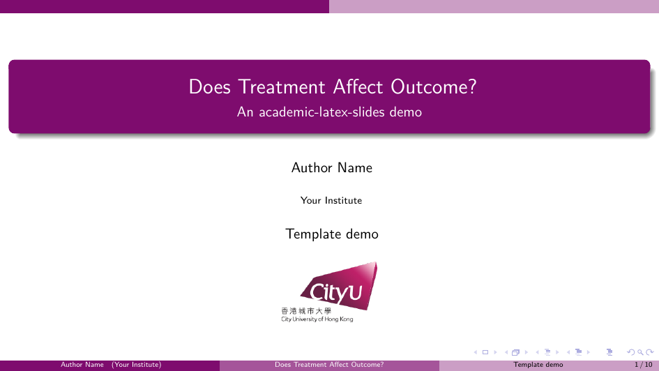
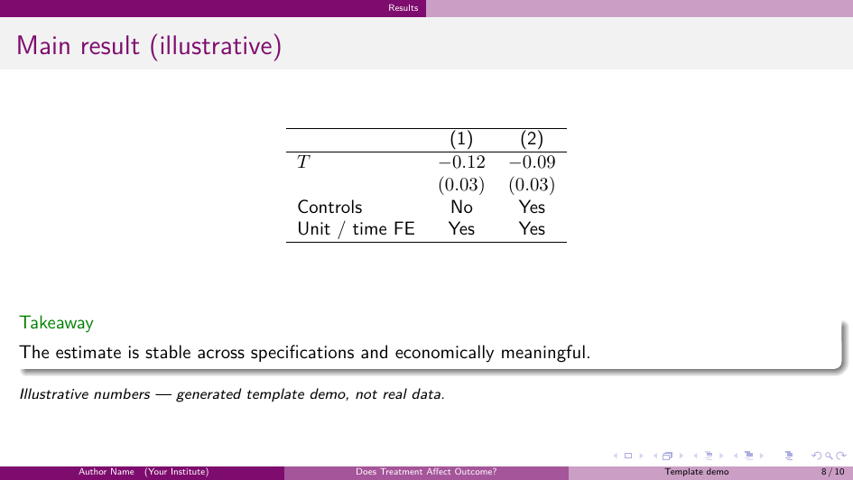

# Examples

Sample decks generated by `academic-latex-slides`. **The same demo
research-talk content** is rendered in all four visual variants, so you can
compare the styles directly — content logic is identical; only the visual
identity changes.

| Variant | PDF |
| --- | --- |
| MSU | [`msu-research-talk.pdf`](msu-research-talk.pdf) |
| SJTU | [`sjtu-research-talk.pdf`](sjtu-research-talk.pdf) |
| CityU | [`cityu-research-talk.pdf`](cityu-research-talk.pdf) |
| Generic | [`generic-research-talk.pdf`](generic-research-talk.pdf) |

Showcase pages (from the CityU deck):

| Title slide | Results slide |
| --- | --- |
|  |  |

## How these were generated

```bash
python skills/academic-latex-slides/scripts/scaffold.py .demo/cityu \
  --template cityu --deck-type research-talk --language en \
  --title "Does Treatment Affect Outcome?" \
  --subtitle "An academic-latex-slides demo" \
  --author "Author Name" --institute "Your Institute" --date "Template demo"
# fill the starter sections with the demo content, then:
cd .demo/cityu && latexmk -xelatex main.tex
```

> The numbers in the results slide are **illustrative placeholders for a
> template demo, not real data**. The skill never invents empirical results
> for a real talk — it produces marked `TODO` placeholders and a
> missing-materials list instead.
